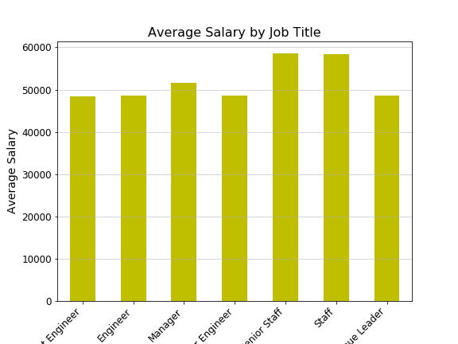

# sql-challenge

## SQL Homework - Employee Database: A mystery in Two Parts
* Due on Thursday: November 14, 2019

### Task: Your first major task is a research project on employees of the corporation from the 1980s and 1990s. All that remain of the database of employees from that period are six CSV files.

In this assignment, you will design the tables to hold data in the CSVs, import the CSVs into a SQL database, and answer questions about the data. In other words, you will perform:
1. Data Modeling - HW07_EmployeeSQL_ERD.png
2. Data Engineering - HW07_EmployeeSQL_Schema.sql
3. Data Analysis - HW07_EmployeeSQL_Query.sql

### Bonus (Optional)
* Jupyter Notebook - python script
* Bar Graph - Average Salary by Title

## Purpose: use Data Modeling, Data Engineering, Data Analysis and BONUS(pandas) skills.